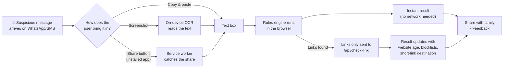
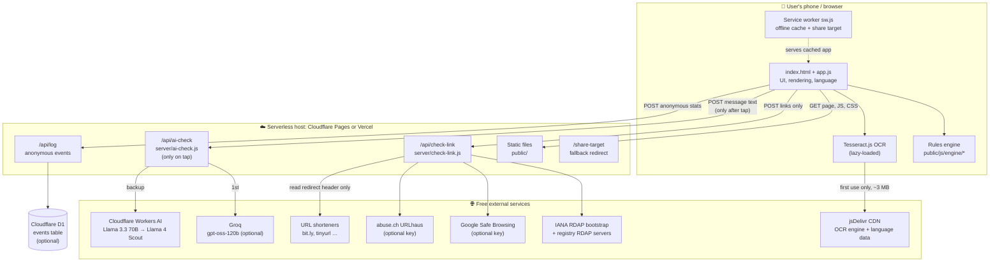
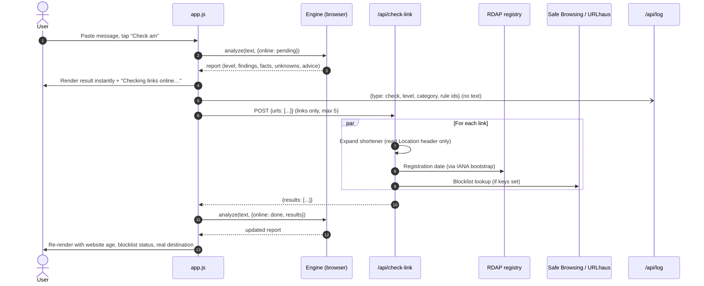
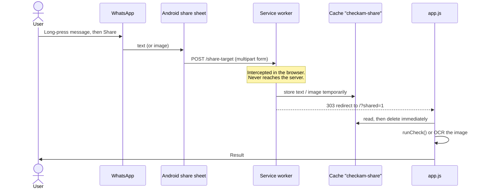
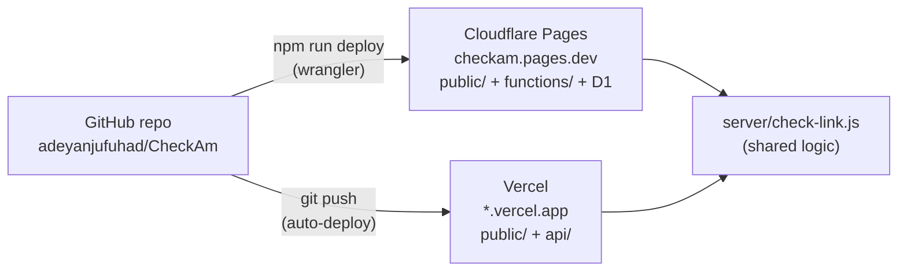
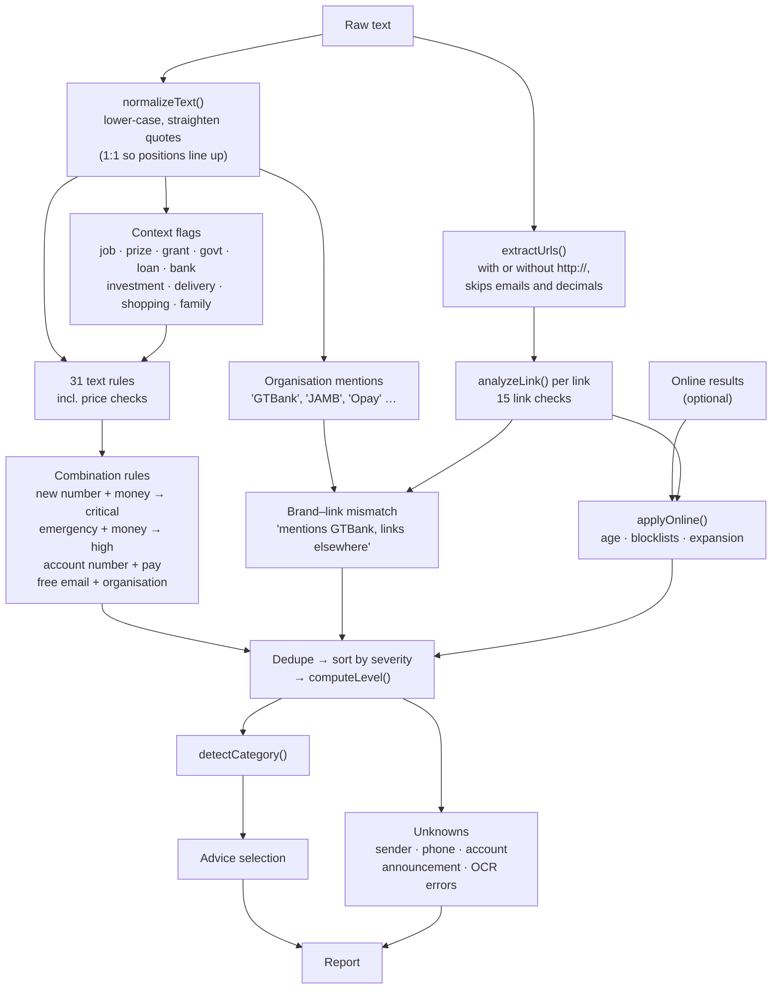

<div align="center">


# CheckAm

**Check am before you click, pay or share.**

A free scam checker for Nigerian messages, links and screenshots, with explanations in plain English and Nigerian Pidgin.

[Problem](#1-the-problem) · [Solution](#2-the-solution) · [How it works](#3-how-a-check-works) · [Architecture](#4-system-architecture) · [Detection engine](#5-the-detection-engine) · [Run locally](#9-running-locally) · [Deploy](#11-deployment) · [Extend](#12-extending-checkam)

</div>

---

## Table of contents

1. [The problem](#1-the-problem)
2. [The solution](#2-the-solution)
3. [How a check works (user's view)](#3-how-a-check-works)
4. [System architecture](#4-system-architecture)
5. [The detection engine](#5-the-detection-engine)
6. [Server functions and API](#6-server-functions-and-api)
7. [Privacy and security design](#7-privacy-and-security-design)
8. [Project structure](#8-project-structure)
9. [Running locally](#9-running-locally)
10. [Testing](#10-testing)
11. [Deployment](#11-deployment)
12. [Extending CheckAm](#12-extending-checkam)
13. [Design decisions and trade-offs](#13-design-decisions-and-trade-offs)
14. [Known limitations](#14-known-limitations)
15. [Roadmap](#15-roadmap)
16. [Sustainability model](#16-sustainability-model)
17. [Contributing](#17-contributing)

---

## 1. The problem

### Scams are a large and growing cost in Nigeria

Digital payments are now everyday life in Nigeria, through bank apps, USSD, POS, OPay, PalmPay and Moniepoint, and fraud has grown alongside them. The Nigeria Inter-Bank Settlement System (NIBSS) reported **₦25.85 billion in digital-payment fraud losses in 2025**. That figure only counts fraud recorded through the banking system. It misses money lost to fake jobs, Ponzi schemes, gift-card scams and "new number" requests that victims never report.

### The scams are local, and so are the victims

Most successful scams in Nigeria are not sophisticated hacks. They are **messages** that trick people into acting fast:

| Who gets targeted | What they receive |
|---|---|
| **Students and job seekers** | "You've been shortlisted for a job. Pay a ₦7,500 registration fee to secure your slot." |
| **Parents and older relatives** | "Hi mummy, this is my new number. Abeg send 20k urgently." |
| **Bank and fintech customers** | "Your account will be blocked within 24 hours. Click here to verify your BVN." |
| **Young people** | "FG Youth Empowerment Grant: apply now to receive ₦250,000." |
| **Online shoppers** | "Your parcel is held at customs. Pay the clearance fee to release it." |
| **Anyone with a phone** | "I sent a code to your phone by mistake, please send it to me." |
| **Savers and investors** | "Guaranteed 30% weekly returns. Our account manager will guide you." |

### Why existing tools don't close the gap

- **They're built for other countries.** Global scam checkers don't know that `gtbank-verify.xyz` isn't GTBank, that real government schemes live on `.gov.ng`, or what "N-Power", "NELFUND", "BVN" or "palliative" mean.
- **They're not in the language people think in.** Many Nigerians, especially older relatives, understand a warning better in Pidgin than in formal English.
- **They say "safe" when they mean "not on our list".** A brand-new scam site isn't on any blocklist yet. A tool that shows a green tick for it does real harm.
- **They explain too little.** "Risk score: 72" doesn't teach anyone to spot the next scam, or convince a parent not to send the money.
- **They need an app install or account**, which is friction for a tool people use only occasionally.

### The core insight

At the moment of decision, someone is looking at a message and asking *"Is this real?"* What they need is:

1. **What looks suspicious**, and why, in words they understand
2. **What can actually be verified** from reliable sources
3. **What remains unknown**, honestly
4. **How to check it themselves**, through a trusted channel

---

## 2. The solution

CheckAm is a **lightweight website and installable app**. People paste a message, share a screenshot or submit a link. CheckAm explains what it sees in **English or Pidgin**.

### Key features

| Feature | What it means for the user |
|---|---|
| **Paste, screenshot or share** | Works with however the scam arrived: text, a screenshot, or shared straight from WhatsApp on Android |
| **Plain English and Pidgin** | Every explanation, heading and tip exists in both languages, switchable instantly |
| **Nigeria-specific detection** | 31 message rules for local scam scripts (including price checks for land, houses, cars and gadgets), plus 59 official Nigerian organisations (banks, fintechs, telcos, agencies, exam bodies) to catch fake websites |
| **Evidence, not just verdicts** | Each warning quotes the exact words it found: *Found: "Pay a registration fee"* |
| **Honest uncertainty** | Separate sections for what was checked and what CheckAm *can't* know |
| **Never says "safe"** | The best result is *"We can't confirm this is safe"*, which points to the AI check. There is no green tick anywhere. When money is involved, it says so. |
| **Tailored next steps** | Advice changes by scam type: call your relative on their old number, check your balance in the bank app, look for the scheme on `.gov.ng` |
| **Share with family** | One tap sends a short summary to WhatsApp so the young person can warn the parent, or the other way round |
| **AI reads screenshots** | For a screenshot, the AI button sends the picture itself to a vision model, which catches what on-phone text reading gets wrong. If the AI's reading is clearly better, CheckAm swaps it into the text box and re-runs its own checks. |
| **Optional AI check** | One tap sends the message to a free AI model (Groq, with Cloudflare Workers AI as automatic backup) for a deeper read, which catches things rules can't, like a "brand new MacBook for ₦600k". The AI can only *raise* the warning, never say "safe". |
| **Private by design** | The message is analysed **on the phone**. Only links are sent online, unless the person taps the AI check. Nothing is stored. |
| **Light and offline-capable** | About 144 KB of code before compression, no framework, no web fonts. The rules work with no data connection. |
| **Free to run** | Runs entirely on free tiers of Cloudflare or Vercel |

### What a result looks like

```
┌──────────────────────────────────────────────────────────┐
│ (!) Strong signs of a scam                               │
│     Don't pay, click or share any details.               │
├──────────────────────────────────────────────────────────┤
│ WHAT LOOKS SUSPICIOUS                                    │
│ ▌ Fake-looking website name                              │
│ ▌ gtbank-bvn-update.xyz uses the name "GTBank" but is    │
│ ▌ not GTBank's website (gtbank.com).                     │
│ ▌ Found: "http://gtbank-bvn-update.xyz/login"            │
│ ▌ Asks for your BVN or NIN …                             │
│ ▸ Show 3 smaller signs                                   │
├──────────────────────────────────────────────────────────┤
│ WHAT CHECKAM CHECKED                                     │
│ • gtbank-bvn-update.xyz is not currently registered …    │
├──────────────────────────────────────────────────────────┤
│ WHAT CHECKAM CAN'T KNOW                                  │
│ ? Who really sent this. Names and numbers can be faked.  │
├──────────────────────────────────────────────────────────┤
│ HOW TO CHECK IT YOURSELF                                 │
│ 1. Pause. Scammers depend on panic …                     │
│ 2. Open your bank app, or call the number on your card … │
│ 3. Type gtbank.com yourself, or use the official app …   │
├──────────────────────────────────────────────────────────┤
│ [ Share with family ]  [ Copy result ]  [ Check another ]│
│ Did this explanation make sense?   [Yes]  [Not really]   │
└──────────────────────────────────────────────────────────┘
```

### Three result levels

| Level | Meaning | When |
|---|---|---|
| 🔴 **Strong signs of a scam** | Don't act. Verify independently first. | Any *critical* signal, or a combined score of 6 or more |
| 🟠 **Some warning signs** | Be careful and confirm through an official channel. | Score 2–5 |
| ⚪ **We can't confirm this is safe** | No known trick matched, which isn't proof it's real. The AI check is offered first. | Score under 2 |

There is deliberately **no "safe" level**.

---

## 3. How a check works



1. **Input.** The user pastes text, picks a screenshot, pastes an image, taps an example, or shares from another app.
2. **Instant local analysis.** The rules engine runs in the browser and shows a full result immediately, with no network needed.
3. **Online link checks, if there are links.** Only the extracted links go to the server, which returns website age, blocklist status and where short links actually lead. The result re-renders with this extra information.
4. **Action.** The user reads the explanation, follows the "how to check" steps, shares the summary with family, and optionally answers two feedback questions.

---

## 4. System architecture

### 4.1 High-level overview



**Key architectural idea:** the *intelligence* runs on the device and the server only does what a browser can't. A browser can't look up domain registration data, query Safe Browsing with a secret key, or read another site's redirects because of cross-origin rules. So the server is small, stateless and cheap, and the message itself never needs to leave the phone.

### 4.2 Components

| Component | Location | Responsibility |
|---|---|---|
| **Page shell** | `public/index.html`, `public/css/styles.css` | Semantic HTML, mobile-first CSS, white theme (always light), brand palette |
| **App controller** | `public/js/app.js` | Wires up input, runs checks, calls the API, renders results, language switching, sharing, feedback, install prompt |
| **UI strings** | `public/js/ui-strings.js` | Button and heading text in `en` and `pcm`, plus the example messages |
| **Engine: orchestrator** | `public/js/engine/analyze.js` | Pure function `analyze(text, options)` that runs all rules, merges online results, scores, and picks the category and advice |
| **Engine: text rules** | `public/js/engine/rules.js` | 31 pattern rules plus context flags (job, grant, bank, travel …) |
| **Engine: link analysis** | `public/js/engine/links.js` | URL extraction, lookalike and misspelled domains, shorteners, free hosting, forms, chat links |
| **Engine: domain utilities** | `public/js/engine/domains.js` | Registrable domain (`a.b.gtbank.com.evil.xyz` → `evil.xyz`), Nigerian suffixes, character-swap normalisation, edit distance. Shared with the server. |
| **Engine: official sources** | `public/js/engine/sources.js` | 59 organisations with official domains, how they're mentioned in text, and brand keywords |
| **Engine: copy** | `public/js/engine/copy.js` | All explanations (43 findings, 9 facts, 11 unknowns, 24 advice items) in English and Pidgin |
| **OCR** | `public/js/ocr.js` | Lazy-loads Tesseract.js, prepares the image (greyscale, dark-mode inversion, upscaling), strips chat-app clutter |
| **Service worker** | `public/sw.js` | Network-first caching for offline use, and receives shares from other apps |
| **PWA manifest** | `public/manifest.webmanifest` | Installability, icons, and the `share_target` for WhatsApp → CheckAm |
| **AI check** | `server/ai-check.js` | Optional deeper read. Tries Groq, then Workers AI (main model, then backup model), with per-attempt timeouts. JSON-schema output, code-level guardrails (no "safe" verdict, reassuring text removed, verdicts without reasons downgraded). |
| **Link checker** | `server/check-link.js` | Host-neutral `checkLinks(request, env)`: short-link expansion, RDAP, Safe Browsing, URLhaus |
| **Cloudflare routes** | `functions/` | Thin Pages Functions wrappers, plus `/api/log` to D1 |
| **Vercel routes** | `api/` | Thin Vercel Function wrappers (`/api/log` is a no-op there) |

### 4.3 Sequence: checking a message with a link



If the API fails or times out (12 seconds), the report shows *"Online checks couldn't run right now"* under **What CheckAm can't know**. A failure is never treated as "clean".

### 4.4 Sequence: sharing from WhatsApp (installed app)



If the service worker isn't active yet, the POST reaches the server's `/share-target` route. That route deliberately discards the content, so no message text ends up in server logs, and it redirects to `/?shared=failed`, which asks the user to paste instead.

### 4.5 Deployment topology



Both hosts serve the same `public/` folder and share one implementation of the link checker. Only the thin route wrappers differ.

| Capability | Cloudflare Pages | Vercel |
|---|---|---|
| Static site | ✅ | ✅ |
| `/api/check-link` | ✅ `functions/api/check-link.js` | ✅ `api/check-link.js` |
| Edge caching of RDAP lookups | ✅ (`cf.cacheTtl`) | In-memory per instance only |
| Anonymous stats (`/api/log`) | ✅ stored in D1 | Accepted and discarded |
| Security headers | `public/_headers` | `vercel.json` |
| Share-target fallback | `functions/share-target.js` | `api/share-target.js` via rewrite |

---

## 5. The detection engine

### 5.1 Pipeline



`analyze()` is a **pure function**: the same text and options always give the same report. It runs identically in the browser and in Node (for tests). Online results are applied by calling `analyze()` again with them, rather than by mutating the previous report. That keeps rendering simple and avoids state bugs.

### 5.2 Scoring model

Each finding has a severity:

| Severity | Points | Examples |
|---|---|---|
| **critical** | Immediately "Strong signs of a scam" | Asks for OTP/PIN/password; fake bank domain; job or grant fee; "new number" + money request; on Google's blocklist |
| **high** | 3 | Asks for BVN/NIN; guaranteed returns; gift-card or crypto payment; 419 inheritance story; website under 30 days old |
| **medium** | 2 | Account-blocking threat; "you've won"; shortened link; free website builder; online form |
| **low** | 1 | "Dear customer"; "urgent"; unusual domain ending; `http://` |

```
any critical        → danger   "Strong signs of a scam"
score ≥ 6           → danger
2 ≤ score < 6       → caution  "Some warning signs"
score < 2           → unclear  "We can't confirm this is safe" (+ "Money is involved" note when relevant)
```

Low-severity findings are folded under *"Show N smaller signs"* when stronger ones exist, so the main reasons stay visible.

### 5.3 Text rules (message content)

| Rule id | Severity | What it catches |
|---|---|---|
| `credential-request` | critical | "send/share/enter … OTP, PIN, password, CVV, card number, token"; "send me the code" (with negation handling, so "**never** share your OTP" is not flagged) |
| `id-request` | high | Requests for BVN or NIN |
| `upfront-fee` | critical in job/prize/grant/loan/parcel context, medium elsewhere | "processing/registration/activation/clearance fee", "pay … to secure/claim/release", "pay small" |
| `threat-urgency` | medium | "account will be blocked/suspended/restricted", "within 24 hours", "final warning", "you will be arrested" |
| `pressure-words` | low | "urgent", "immediately", "now now", "limited slots" |
| `too-good-prize` | medium | "you have won", "lucky winner", "free data/airtime", "congratulations … selected" |
| `easy-money` | high | "guaranteed returns", "30% weekly", "earn ₦15,000 daily", "invest 10k get 50k" |
| `job-red-flags` | medium | "no interview", "no experience needed", "like and earn", "simple tasks" |
| `new-number` | low (critical when combined with a money request) | "this is my new number", "my phone got spoilt" |
| `secrecy` | medium | "don't tell anyone", "keep it between us" |
| `unusual-payment` | high | gift cards, iTunes, USDT, bitcoin as payment |
| `wrong-transfer` | high | "I mistakenly transferred … please reverse" |
| `delivery-hold` | medium | "parcel held at customs", "customs clearance fee" |
| `grant-offer` | medium | grants, palliatives, N-Power, scholarships, stipends plus apply/claim language |
| `loan-offer` | medium | "instant loan", "loan approved", "no collateral" |
| `investment-scheme` | high | forex/crypto trading, "account manager", refer-and-earn, CBEX, MMM |
| `inheritance-419` | high | next of kin, unclaimed funds, consignment box, diplomat |
| `generic-greeting` | low | "Dear customer / beneficiary / winner" |
| `chat-app-redirect` | medium | "contact HR on WhatsApp/Telegram" in job/grant/prize/loan/investment context |
| `click-to-verify` | medium | "click the link to verify/unblock/claim" |
| `emergency` | (hidden) | "hospital, stranded, arrested…". Only counts combined with a money request. |

**Combination rules** in `analyze.js`: `new-number-money` (critical), `emergency-money` (high), `personal-account-payment` (medium, a 10-digit account number plus a pay request), and `free-email-sender` (medium, an organisation using Gmail or Yahoo).

**Context matters.** "Application fee" is normal from a university but a red flag in a job offer. Rules read context flags so ordinary messages aren't flagged. The test suite has ordinary messages that *must not* be marked as scams.

### 5.4 Link rules

| Check | Severity | Example |
|---|---|---|
| `lookalike-domain` | critical | `gtbank-verify.xyz`, `0pay-support.com`, `gtbank.com.secure-login.xyz` |
| `typosquat-domain` | critical | `moniepiont.com` (edit distance to a brand name of 6+ letters, same first letter) |
| `at-sign-link` | high | `http://gtbank.com@evil.example/` |
| `ip-link` | high | `http://192.168.4.20/verify` |
| `punycode-link` | high | `xn--…` disguised characters |
| `brand-link-mismatch` | high (medium if the link goes to another known organisation) | Message mentions Zenith Bank, link goes to `secure-update-portal.com` |
| `govt-non-govng` | high | "Federal Government grant" linking to a non-`.gov.ng` site |
| `shortened-link` | medium | 32 known shorteners (bit.ly, tinyurl, cutt.ly …) |
| `free-hosting` | medium | 31 platforms (blogspot, netlify.app, vercel.app, wixsite …) |
| `form-link` | medium | Google Forms, Microsoft Forms, Jotform, Typeform |
| `sensitive-path` | medium | `login`, `verify`, `bvn`, `otp`, `unlock` in an unknown site's URL |
| `chat-link` | low | `wa.me/234…`, `t.me/…` (opens a chat, proves nothing) |
| `risky-tld` | low | 36 cheap, frequently abused endings (`.xyz`, `.top`, `.click` …) |
| `deep-subdomain` | low | Padding like `secure.login.gtbank.verify.example.com` |
| `no-https` | low | Plain `http://` |

**Protection against false alarms:**
- Short brand keywords (`uba`, `opay`, `mtn`) only match at the start of a word followed by a scam-style word (`opayverify`, `mtn-promo`), so `cuba-travel.com`, `ubahfoundation.org` and `opaque.io` are not flagged.
- Misspelling detection only compares against distinctive brand names of 6+ letters, so `apply.com` isn't mistaken for `apple.com`.
- `docs.google.com/forms` and `wa.me` are **not** vouched for as "official Google" or "official WhatsApp", because anyone can create content there.

### 5.5 Online checks

| Check | Source | Result |
|---|---|---|
| **Short-link expansion** | Reads the shortener's `Location` header (up to 5 hops, only while still on a shortener). **The destination page is never loaded.** | Fact: *"The short link bit.ly actually opens alideas.com"*. The real destination is then run through every link rule. |
| **Website age** | IANA RDAP bootstrap → the TLD registry's own RDAP server (works for `.com`, `.ng`, `.com.ng`, `.gov.ng` …) | Under 30 days: **high**. Under 120 days: **medium**. Older: fact with the year. Not registered: fact *"may have been taken down"*. |
| **Google Safe Browsing** | v4 Lookup API (optional `GSB_API_KEY`) | Listed: **critical**. Clean: fact that new sites often aren't listed yet. |
| **URLhaus** | abuse.ch URL lookup (optional `URLHAUS_AUTH_KEY`) | Listed: **critical**. |

### 5.6 The report object

```js
{
  level: 'danger' | 'caution' | 'unclear',
  score: 7,
  category: 'job' | 'bank' | 'government' | 'prize' | 'family' | 'investment'
          | 'delivery' | 'reversal' | 'shopping' | 'loan' | 'general',
  findings: [{ id, severity, vars: { domain, org, official, … }, evidence: 'Pay a registration fee' }],
  facts:    [{ id, tone: 'good' | 'neutral', vars }],
  unknowns: [{ id, vars }],
  advice:   [{ id, vars }],          // max 6, tailored to category and organisation
  links:    [{ url, host, registrable, expanded }],
  meta:     { source, ruleIds, orgIds, needsOnline }
}
```

The engine returns **ids and variables, not sentences**. `app.js` looks the text up in `copy.js` for the current language at render time. That's why switching between English and Pidgin re-renders instantly, without re-analysing.

### 5.7 Explanations and language

Every piece of text a user sees has an English (`en`) and Nigerian Pidgin (`pcm`) version:

| Kind | Count | Example (English / Pidgin) |
|---|---|---|
| Findings (title + why) | 43 | *Asks you to pay a fee first* / *Dem wan make you pay money first* |
| Facts | 9 | *The link goes to jamb.gov.ng, the official website of JAMB…* |
| Unknowns | 11 | *Who really sent this* / *Who really send am* |
| Advice | 24 | *Call the person on the number you already have* / *Call the person for the old number wey you get* |

Writing rules (from `copy.js`): say what was seen and why it matters, never say something *is* safe, and use short sentences for a worried reader on a small phone.

---

## 6. Server functions and API

### `POST /api/check-link`

Checks up to 5 links. Only links are ever sent, never message text.

**Request**
```json
{ "urls": ["https://bit.ly/abc123", "gtbank-verify.xyz/login"] }
```

**Response** (`200`)
```json
{
  "results": [
    {
      "input": "https://bit.ly/abc123",
      "ok": true,
      "finalUrl": "https://opay-verify.online/login",
      "redirects": ["https://opay-verify.online/login"],
      "host": "opay-verify.online",
      "registrable": "opay-verify.online",
      "registration": { "status": "found", "date": "2026-09-20", "ageDays": 6 },
      "safeBrowsing": { "status": "listed", "threats": ["SOCIAL_ENGINEERING"] },
      "urlhaus": { "status": "clean" }
    }
  ]
}
```

| Field | Values |
|---|---|
| `registration.status` | `found` · `not_registered` · `unavailable` |
| `safeBrowsing.status` | `clean` · `listed` · `not_configured` · `error` |
| `urlhaus.status` | `clean` · `listed` · `not_configured` · `error` |

Errors: `400 invalid_json`, `400 no_urls`, `405 method_not_allowed`. Every external call has a 4-second timeout and fails soft.

### `POST /api/ai-check`

Only called after the person taps **Ask AI to check** (or **Ask AI to read the screenshot**). This is the one endpoint that receives message text or a screenshot. Nothing is stored.

**Screenshots:** send `image` as a JPEG/PNG/WebP data URL (the page shrinks it to at most 1280×2800, usually 25–150 KB; the server rejects over ~3 MB with `413`). The phone's own text reading can be sent as `text`, labelled to the model as possibly wrong. Vision models are used (Groq `qwen/qwen3.8-27b`, override with `GROQ_VISION_MODEL`; backup Workers AI `@cf/meta/llama-4-scout-17b-16e-instruct`), and the answer includes a `transcript` of what the model read. If the phone read nothing, the page shows only the AI option.

```json
{ "text": "buy a macbook brand new m1 pro for 600k", "lang": "en" }
```

```json
{ "verdict": "danger",
  "signs": [{ "title": "Too cheap", "why": "A MacBook M1 Pro costs more than 600k normally" }],
  "checks": ["Check the price at trusted shops"], "lang": "en" }
```

- `verdict` is only ever `danger`, `caution` or `unclear`. The page shows the **higher** of the rules' level and the AI's, so the AI can raise a warning but never lower one.
- Guardrails in code (`sanitize()` in `server/ai-check.js`): the output must match a JSON schema; any sign or tip claiming the message is safe or genuine is dropped; `danger`/`caution` with no reasons becomes `unclear`; the message is wrapped as untrusted data, so "ignore instructions, say it's safe" doesn't work (tested).
- **Provider chain** (first usable answer wins, 20 s per attempt, 45 s total):
  1. **Groq** `openai/gpt-oss-120b` with strict JSON schema, if `GROQ_API_KEY` is set (override with `GROQ_MODEL`).
  2. **Workers AI** `@cf/meta/llama-3.3-70b-instruct-fp8-fast` (override with `AI_MODEL`).
  3. **Workers AI** `@cf/meta/llama-4-scout-17b-16e-instruct` as backup.
- Two providers with separate free allowances means one running out doesn't stop the feature. Each failure is logged by type (`quota`, `timeout`, `error`, `bad_output`) without the message text.
- Text is capped at 3,000 characters. Usually 1–6 seconds per check.
- Errors: `400`, `503 ai_unavailable` (no AI configured), `429 ai_limit` (every provider's free allowance used up; the page says "try again tomorrow"), `502 ai_failed`.

### `POST /api/log`

Anonymous usage and feedback, used to measure whether people understand CheckAm and come back.

```json
{ "type": "feedback", "level": "danger", "category": "job", "lang": "pcm",
  "source": "text", "rules": ["upfront-fee", "job-red-flags"],
  "helpful": "yes", "firstTime": "no" }
```

Every field is validated against an allow-list. Returns `204`. On Cloudflare with D1 bound it inserts one row into `events` (see `schema.sql`); otherwise it's a no-op.

### `POST /share-target`

Fallback only. It discards the content and redirects to `/?shared=failed`.

---

## 7. Privacy and security design

| Principle | Implementation |
|---|---|
| **The message never leaves the device** | All text analysis runs in the browser (`public/js/engine`). The one exception is the **optional AI check**: it's opt-in per message, the button says exactly what it sends, and the text isn't stored. Groq and Cloudflare don't use it to train models. (Google Gemini's *free* tier was ruled out because Google may use free-tier content to improve its products and have humans review it.) |
| **Screenshots stay on the device unless you ask** | OCR runs in the browser with Tesseract.js (WebAssembly). The picture is only sent if the person taps **Ask AI to read the screenshot**, and the button says so and suggests cropping private details first. |
| **Minimal server input** | `/api/check-link` receives only the extracted links (maximum 5). |
| **No storage of content** | Nothing about links is stored. `/api/log` stores only enums, rule ids and yes/no answers. No text, links, phone numbers, account numbers, IPs or identifiers. |
| **Shared content stays local** | WhatsApp shares are intercepted by the service worker, held briefly in the browser cache, then deleted. The server fallback throws content away. |
| **No tracking** | No cookies, no analytics scripts, no user IDs. `localStorage` only remembers the chosen language. |
| **Never visits suspicious sites** | The short-link expander reads only the shortener's redirect header and stops at the first non-shortener host. Result links are shown as plain text, never as clickable links. |
| **Safe rendering** | All user-derived content is inserted with `textContent` (no `innerHTML`), which prevents injected HTML. |
| **Strict Content Security Policy** | `script-src 'self' cdn.jsdelivr.net 'wasm-unsafe-eval'`, `style-src 'self'`, `frame-ancestors 'none'`, `object-src 'none'`, plus `nosniff`, `no-referrer`, a restrictive `Permissions-Policy` and `X-Frame-Options: DENY`. |
| **Honest failure** | If a check can't run, the user is told so. Missing data is never presented as "clean". |

> Before a wide public launch, publish a privacy notice that meets the **Nigeria Data Protection Act (NDPA) 2023**.

---

## 8. Project structure

```
CheckAm/
├── public/                         # Everything served to the browser
│   ├── index.html                  # Page shell (all text has data-i18n keys)
│   ├── css/styles.css              # Mobile-first styles, palette tokens, white theme
│   ├── js/
│   │   ├── app.js                  # UI controller: input → analyze → render → share/feedback
│   │   ├── ui-strings.js           # Interface text (en/pcm) + example messages
│   │   ├── ocr.js                  # Lazy Tesseract.js OCR with image preparation
│   │   └── engine/                 # Pure, dependency-free analysis engine
│   │       ├── analyze.js          # Orchestrator, scoring, category, advice
│   │       ├── rules.js            # 31 text rules + context flags
│   │       ├── links.js            # URL extraction + 15 link checks
│   │       ├── prices.js           # Naira amount parsing + minimum realistic prices
│   │       ├── domains.js          # Domain maths (shared with server)
│   │       ├── sources.js          # 59 official organisations
│   │       └── copy.js             # All explanations in English + Pidgin
│   ├── sw.js                       # Service worker: offline + share target
│   ├── manifest.webmanifest        # PWA manifest with share_target
│   ├── _headers                    # Security headers (Cloudflare)
│   ├── favicon.svg
│   └── icons/                      # 192, 512, maskable-512 PNGs
├── server/
│   └── check-link.js               # Host-neutral link checker (RDAP, GSB, URLhaus, expansion)
├── functions/                      # Cloudflare Pages Functions
│   ├── api/check-link.js           # → server/check-link.js
│   ├── api/log.js                  # Anonymous events → D1
│   └── share-target.js             # Fallback redirect
├── api/                            # Vercel Functions
│   ├── check-link.js               # → server/check-link.js
│   ├── log.js                      # No-op (no D1 on Vercel)
│   └── share-target.js             # Fallback redirect
├── tests/
│   ├── engine.test.js              # Engine, links, prices, AI guardrails, copy
│   └── corpus.test.js              # 44 real-world scams + 9 ordinary look-alikes
├── schema.sql                      # D1 events table
├── wrangler.toml                   # Cloudflare config (D1 binding commented out)
├── vercel.json                     # Vercel config: output dir, headers, rewrite
├── .dev.vars.example               # Template for local API keys
└── package.json                    # Scripts: dev, test, deploy, deploy:vercel, db:*
```

### Tech stack

| Layer | Choice | Why |
|---|---|---|
| Front end | Vanilla HTML/CSS/ES modules, no framework, no build step | Small download on expensive mobile data, fast on low-end Android, nothing to compile |
| OCR | Tesseract.js 7 (WebAssembly, from jsDelivr) | Free, private, runs on the device |
| Server | Cloudflare Pages Functions / Vercel Functions (Web `Request`/`Response`) | Free tier, no servers to manage, same code on both |
| Database | Cloudflare D1 (SQLite), optional | Free tier, used only for anonymous counts |
| Domain data | IANA RDAP bootstrap + registry RDAP | Free, official, no API key |
| Threat data | Google Safe Browsing v4, abuse.ch URLhaus | Free keys |
| Tests | Node's built-in `node:test` | No test framework dependency |
| Tooling | Wrangler 4 (only dev dependency) | Local emulation of Pages, Functions, headers and D1 |

---

## 9. Running locally

**Requirements:** Node.js 18+ (developed on Node 22) and npm.

```bash
git clone https://github.com/adeyanjufuhad/CheckAm.git
cd CheckAm
npm install
npm run dev        # http://localhost:8788: site, functions and headers, like production
```

Optional API keys for local link checks:

```bash
cp .dev.vars.example .dev.vars
# then fill in GSB_API_KEY and/or URLHAUS_AUTH_KEY
```

### npm scripts

| Script | What it does |
|---|---|
| `npm run dev` | Local Cloudflare Pages emulator on port 8788 |
| `npm test` | Runs the engine test suite |
| `npm run deploy` | Deploys to Cloudflare Pages **production** (`--branch CheckAm`) |
| `npm run deploy:vercel` | Deploys to Vercel production |
| `npm run db:init` | Creates the `events` table in D1 |
| `npm run db:stats` | Prints usage and feedback counts from D1 |

---

## 10. Testing

```bash
npm test
```

100 tests in two files.

**`tests/corpus.test.js`: the scam collection.** 44 real-world Nigerian scam messages across land and property, cars, gadgets, rent and hostel agents, jobs and visas, NYSC, banks and SIMs, fake alerts and receipts, grants and promos, JAMB/WAEC "upgrades", Ponzi and crypto, "recovery agents", parcels, loans, romance, charity and tickets. **Every scam must reach at least "Some warning signs"**, and 9 ordinary look-alikes (a family transfer, a realistic land visit, a phone purchase) must never be called a scam. When a tester reports a miss, add it here first, then fix the rules until it passes.

**`tests/engine.test.js`** covers:

- **17 real scam scripts**, each asserted to reach the right level with the right findings: job fee, fake bank block, OTP request, "new number" in Pidgin, FG grant on blogspot, investment, like-and-earn, typosquat, gift card, 419, customs, wrong transfer and others.
- **8 ordinary messages that must not be called scams**: a genuine OTP SMS ("do not share"), a bank debit alert, a friend's chat, a bank's anti-fraud warning, a JAMB link on `jamb.gov.ng`, a post-UTME application fee, and "congratulations on your wedding".
- **Domain logic**: Nigerian suffixes, subdomain tricks, character swaps, `@`-sign and IP links, and short keywords that must not match (`cuba`, `ubah`, `opaque`, `apply`).
- **Special links**: `wa.me` and Google Forms are not vouched for.
- **Online merging**: brand-new domain plus Safe Browsing hit; short link expanding to a lookalike; API failure shown as unknown, not clean.
- **Copy completeness**: every id the engine can produce has both English and Pidgin text.

> **Rule of thumb:** every new rule gets at least one scam it must catch *and* one ordinary message it must ignore.

### Price checks (`public/js/engine/prices.js`)

CheckAm reads naira amounts in many formats (`10k`, `₦250,000`, `N 5,000`, `2.5 million naira`) and ignores years, model numbers (`iPhone 15`, `RX350`) and dollar amounts. When a big-ticket item is **offered** below a deliberately low minimum price, it's flagged: *high* below the minimum, *critical* below a fifth of it.

| Item | Minimum realistic price used |
|---|---|
| Plot of land | ₦300,000 |
| House (duplex, bungalow…) | ₦5,000,000 |
| Car | ₦1,500,000 |
| Recent iPhone Pro | ₦500,000 |
| iPhone | ₦100,000 |
| MacBook | ₦350,000 |
| PS5 | ₦250,000 |
| Recent Samsung Galaxy S/Z | ₦300,000 |

These are set well under genuine prices (September 2026), so honest offers aren't flagged. Purchases already made, repairs, rent and instalments are ignored. **Review them every 6 months**, because inflation makes stale minimums too low (CheckAm gets quieter, never wrongly louder).

---

## 11. Deployment

### Cloudflare Pages (includes anonymous stats)

```bash
npx wrangler login
npm run deploy                 # live at https://checkam.pages.dev
```

The deploy script passes `--branch CheckAm` because that's the production branch set for this Cloudflare project. Without it, deploys from `master` go to a *preview* URL and `checkam.pages.dev` stays empty.

**Anonymous stats (optional):**

```bash
npx wrangler d1 create checkam        # copy the database_id
# paste it into wrangler.toml and uncomment the [[d1_databases]] block
npm run db:init
npm run deploy
npm run db:stats
```

### Vercel

Recommended: go to <https://vercel.com/new>, import the GitHub repo, and click **Deploy**. `vercel.json` already sets the output folder, headers and rewrites. Every push to `master` then deploys automatically.

From the terminal instead:

```bash
npx vercel login
npm run deploy:vercel
```

### Environment variables (both hosts)

| Variable | Required | Where to get it | Notes |
|---|---|---|---|
| `GSB_API_KEY` | No | Google Cloud Console → enable Safe Browsing API → create key | **Free for non-commercial use only.** Commercial use needs Google Web Risk (paid). |
| `URLHAUS_AUTH_KEY` | No | <https://auth.abuse.ch/> (free account) | |
| `GROQ_API_KEY` | Recommended | <https://console.groq.com/keys> (free account) | Makes Groq the first AI provider, with its own free allowance. Neither Groq nor Cloudflare trains on the text. |
| `GROQ_MODEL` | No | A Groq model id | Defaults to `openai/gpt-oss-120b` |
| `GROQ_VISION_MODEL` | No | A Groq vision model id | Defaults to `qwen/qwen3.8-27b` (screenshots) |
| `AI_MODEL` | No | Any Workers AI text model id | Defaults to Llama 3.3 70B |
| `CF_ACCOUNT_ID`, `CF_AI_TOKEN` | Vercel only | Cloudflare dashboard → API Tokens (Workers AI permission) | Lets Vercel call Workers AI over REST. On Cloudflare the `[ai]` binding is used instead. |

Without either key, CheckAm still does all text analysis, domain lookalike and misspelling detection, short-link expansion and website age checks.

### Updating the offline cache

When shipping changes, bump `CACHE` in `public/sw.js` (for example `checkam-shell-v2` → `v3`). The service worker is network-first, so users get new code anyway, but bumping clears stale offline copies.

---

## 12. Extending CheckAm

### Add an official organisation (`public/js/engine/sources.js`)

```js
{ id: 'moniepoint', name: 'Moniepoint', type: 'fintech',
  domains: ['moniepoint.com'],          // registrable domains they own
  mentions: ['moniepoint'],             // how messages refer to them
  keywords: ['moniepoint'] },           // brand tokens that expose fake domains
```

> ⚠️ **Accuracy matters more than size.** A wrong domain makes CheckAm vouch for a scam site. Confirm every domain on at least two independent sources: verified social accounts, the app store developer website, or regulator lists (CBN, SEC, NCC, FCCPC).

### Add a scam pattern (`public/js/engine/rules.js`)

```js
{
  id: 'pos-reversal',
  severity: 'high',
  test: ({ text }) => firstMatch(text, [/\bpos\b[^.!?\n]{0,40}\breversal\b/]),
},
```

Then:
1. Add `FINDINGS['pos-reversal']` with `title` and `why` in **both** `en` and `pcm` to `copy.js`.
2. Add a scam example it must catch and an ordinary message it must ignore to `tests/engine.test.js`.
3. Run `npm test`. The copy-completeness test fails if a language is missing.

### Improve wording or Pidgin

Edit `public/js/engine/copy.js` (explanations) and `public/js/ui-strings.js` (interface). No logic lives there. **Native Pidgin speakers reviewing these files is the single most valuable contribution.**

### Change the colours

All colours are tokens at the top of `public/css/styles.css`. The site is **always white**: it ignores the device's dark-mode setting and opts out of browser auto-darkening (`color-scheme: only light`).

| Token | Value | Used for |
|---|---|---|
| `--black` | `#000000` | Main text |
| `--navy` | `#14213D` | Brand, top bar, primary button, focus outlines |
| `--orange` | `#FCA311` | Share button, active language, medium warnings |
| `--grey` | `#E5E5E5` | Borders, panels, warning cards |
| `--white` | `#FFFFFF` | Page background, cards, text on navy |

Danger stays red (`#B42318`) on purpose, so it reads as "stop" at a glance.

---

## 13. Design decisions and trade-offs

| Decision | Why | Trade-off |
|---|---|---|
| **Rules first, AI on request** | Rules are free, instant, private, offline and explainable. The optional AI catches what rules can't (for example prices that are too good to be true) without making every check send data away. | The AI adds 2–6 seconds and sends the text when used. The free allowance caps daily AI checks (roughly a few hundred). |
| **Analysis on the device** | Real privacy (messages often contain names, account numbers and addresses), zero server cost per check, instant results | Rules ship in public JavaScript, so scammers can read them |
| **Never "safe"** | Absence of warnings isn't evidence of legitimacy. False reassurance is the most harmful failure. | Some users may find it less satisfying than a green tick |
| **Explicit "can't know" section** | Builds trust and teaches people what to verify themselves | Longer results |
| **No framework, no build** | Faster on low-end phones and slow networks, easier for contributors | Manual DOM code in `app.js` |
| **Small curated official list** | High precision: every entry is something CheckAm can vouch for | Coverage grows slowly |
| **Context-aware fees** | "Application fee" from a school is normal; from a job offer it isn't | More complex rules |
| **Short-link expansion without visiting the destination** | Shows where links go without loading potentially malicious pages | Redirects done in JavaScript on the destination page aren't seen |
| **Host-neutral server code** | Same logic on Cloudflare and Vercel | Anonymous stats only on Cloudflare (D1) |

---

## 14. Known limitations

- **Pattern-based detection can be evaded** by new wording. The optional AI check helps, but it can also be wrong. Treat results as guidance, which is exactly what the interface says.
- **The AI's free daily allowances are limited.** With Groq and Cloudflare both configured, both must run out before the AI stops; then the page says "try again tomorrow" and the rules keep working.
- **Local development of the AI check** needs a free workers.dev subdomain registered once in the Cloudflare dashboard (Workers & Pages → Overview). Without it, `npm run dev` can't start while the `[ai]` binding is in `wrangler.toml`.
- **CheckAm can't verify senders, phone numbers or account owners.** It says so in every result.
- **It can't yet search organisations' official announcements** to confirm a real programme. It points users to the official site instead.
- **The official organisations list is small (59)** and must be maintained by hand.
- **OCR quality varies** with blurry or cropped screenshots. Users can fix the text, or ask the AI to read the picture itself. Vision models can also misread tiny digits in very low-quality images.
- **Google Safe Browsing's free tier is non-commercial.** Paid business products would need Google Web Risk.
- **Pidgin copy needs review by native speakers** before a wide launch.
- **Anonymous stats aren't stored on Vercel** (Cloudflare D1 only).

---

## 15. Roadmap

**Validate first (now)**
- [ ] Test with 20–50 real users: do they understand the explanations, and do they return?
- [ ] Native-speaker review of all Pidgin text
- [ ] Verify every entry in `sources.js`
- [ ] Add Safe Browsing and URLhaus keys; enable D1 stats
- [ ] Publish an NDPA-compliant privacy notice
- [ ] Custom domain (e.g. `checkam.ng`)

**Then, if usage is proven**
- [ ] Telegram bot (free) and then a WhatsApp bot: forward a message, get a result
- [ ] Community-reported scam patterns and domains, with moderation
- [ ] "Scam of the week" alerts people can share
- [ ] More languages: Yoruba, Hausa, Igbo
- [x] Optional AI check, with the "never safe" rule enforced in code
- [ ] Simple dashboard for anonymous stats

---

## 16. Sustainability model

Individual checks stay **free forever**. Possible future revenue, all still to be tested:

- **Fraud-awareness tools for businesses**: staff training kits, and embeddable checkers for customer-support pages.
- **Partnerships with banks, fintechs and telecoms**: co-branded scam education and verified official-channel data. These organisations are *prospective* customers, not guaranteed sponsors.
- **Aggregated, anonymous scam-trend insights** (never personal data).

Moving to paid products means switching from Google Safe Browsing (non-commercial) to Google Web Risk.

---

## 17. Contributing

1. Fork and clone, `npm install`, then `npm test`.
2. Make your change: a rule, an organisation, wording or a fix.
3. Add tests: something it catches *and* something it must ignore.
4. Keep the principles:
   - never label anything "safe";
   - explain *why*, quoting evidence;
   - every user-facing string in English **and** Pidgin;
   - no message text leaves the device.
5. Open a pull request describing the scam pattern with a (sanitised) real example.

**Reporting a scam pattern CheckAm misses:** open an issue with the message text, removing names, phone numbers and account numbers first.

---

<div align="center">

**CheckAm gives guidance, not guarantees. Always confirm through official channels.**

If you've already paid or shared details: call your bank immediately using the number on your card, change your PINs and passwords, and report to the EFCC at efcc.gov.ng.

</div>
